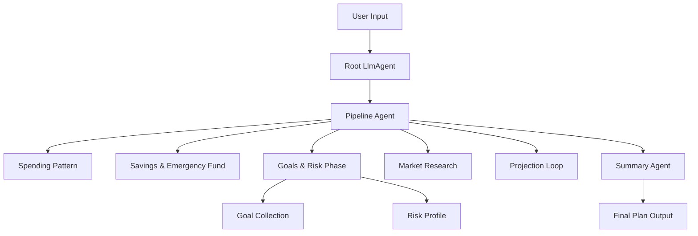

# 🧠 Multi-Agent Investment Planner  
  

A fully orchestrated, multi-agent financial planning system powered by **Google ADK** and **Gemini**, designed to help users build a complete, personalized investment plan using intelligent agent collaboration.

---

## 📌 Overview

Most individuals struggle to understand their financial position, create savings plans, define investment goals, assess risk, and predict future growth. Traditional financial tools solve only one part of the problem.

The **Multi-Agent Investment Planner** solves this by using a **team of specialized AI agents**, each focusing on a specific financial task:

- Spending Pattern Analysis  
- Savings & Emergency Fund Planning  
- Goal Categorization  
- Risk Profiling  
- Market Research  
- Long-Term Investment Projection  
- Final Summary & Recommendations  

Each agent performs one domain-specific task and passes structured context forward. The system acts like a fully coordinated financial advisor team.

Built using:

- **Google Agent Developer Kit (ADK)**
- **Gemini 2.0 / 2.5 Models**
- **Sequential, Parallel, and Loop Agents**
- **FunctionTools for Financial Calculations**
- **Session Memory for State Preservation**
- **Structured Logging, Metrics & Tracing**

---

## 🚀 Quick Start — Running the Project

### **1. Clone the Repository**

```bash
git clone https://github.com/Sasikiranmayi/multi-agent-investment-planner.git
cd multi-agent-investment-planner
```

### **2. Create and Activate Virtual Environment**

```bash
python -m venv .venv
source .venv/bin/activate     # macOS / Linux
.venv\Scripts\activate        # Windows
```

### **3. Install Dependencies**

```bash
pip install -r requirements.txt
```

### **4. Set Your Environment Variables**

Create a `.env` file:

```bash
GOOGLE_API_KEY=YOUR_KEY_HERE
```

### **5. Run Using ADK Web UI**

```bash
adk web
```

This launches an interactive UI where you can chat with the planner and watch all agents execute step-by-step.

### **6. OR Run Using Python Runner (main.py)**

```bash
python main.py
```

This starts the system using ADK’s `Runner` with full logs and console-based interaction.

---

## 📁 Project Structure

```
multi-agent-investment-planner/
│
├── investment_planner/
│   ├── agents/     
│   │   ├── spending_pattern_agent.py    # Expense + surplus analysis
│   │   ├── savings_agent.py             # Savings + emergency fund computation
│   │   ├── goal_collection_agent.py     # Short / Medium / Long-term goals
│   │   ├── risk_profile_agent.py        # Risk comfort + risk category
│   │   ├── market_research_agent.py     # Market condition insights
│   │   ├── projection_agent.py          # Loop agent for long-term projections
│   │   ├── summary_agent.py             # Consolidated investment plan
│   │   └── __init__.py
│   │
│   ├── tools/
│   │   └── calculators.py               # SIP FV, compound interest, surplus logic
│   │
│   ├── agent.py                         # Root wiring: Sequential + Parallel agents
│   │
│   ├── observability/
│   │   └── logging_config.py            # Logging setup
│   │
│   └── tests/
│       ├── test_spending_agent.py
│       ├── test_savings_agent.py
│       ├── test_goal_agent.py
│       ├── test_risk_agent.py
│       ├── test_market_agent.py
│       ├── test_projection_agent.py
│       └── __init__.py
│
├── main.py
├── requirements.txt
├── .env
└── README.md
```

---

## 🧱 System Architecture

### **High-Level Design**



---

## 🤝 How Agent Coordination Works

### **Root LlmAgent**
- Begins by collecting the full financial profile.
- This is the only agent that interacts with the user.
- Sets `profile_completed=true` when enough data is collected.
- Only then triggers the planner agent pipeline.

### **Planner Agent (SequentialAgent)**
Executes each domain step in strict order:

1. **Spending Pattern Agent**  
2. **Savings & Emergency Fund Agent**  
3. **Parallel Goals & Risk Agents**  
4. **Sequential Market Research**
5. **Projection Loop**  
5. **Summary Agent**

### **Parallel Agents**
Two agents run simultaneously to speed up analysis:

```
GoalsAndRiskPhase:
    - GoalCollectionAgent
    - RiskProfileAgent
```

### **Loop Agent**
`ProjectionLoopAgent` runs multi-year forecasting iteratively:

- Best case  
- Expected case  
- Worst case  
- Year-by-year SIP/lumpsum growth  

---

## 🔧 ADK Tools & FunctionTools Used

### **1. FunctionTools**

#### `compound_interest`
Used inside projection loop:

```python
FunctionTool(compound_interest)
```

#### `sip_growth`
Used for investment goal fulfillment:

```python
FunctionTool(sip_growth)
```

#### `savings_rate`
Used inside Spending Pattern:

```python
FunctionTool(savings_rate)
```

#### `calculate_emergency_fund`
Used inside Savings Plan:

```python
FunctionTool(calculate_emergency_fund)
```

---

## 📊 Observability — Logging, Tracing, Metrics

The project includes:

### **Structured Logging**
`logging_config.py` sets:

- Timestamp
- Module name
- Log level
- Agent execution breadcrumbs

### **Tracing (optional)**
You can enable:

```python
from google.adk.tracing import Tracer
```

### **Metrics**
You can log counters:

```python
metrics.increment("spending_agent_runs")
metrics.timer("projection_latency")
```

The system is observability-ready for Kaggle or production.

---

## 🧪 Running Tests

Tests are located in `investment_planner/tests/`

Run all tests:

```bash
pytest -q
```

Run a specific test file:

```bash
pytest tests/test_goal_agent.py -q
```

---

## 📚 ADK Documentation

- ADK Official Docs:  
  https://google.github.io/adk-docs/
- ADK Agent Models:  
  https://google.github.io/adk-docs/agents/
- ADK Tools:  
  https://google.github.io/adk-docs/tools/
- ADK Memory & Sessions:  
  https://google.github.io/adk-docs/memory/
- ADK Observability:  
  https://google.github.io/adk-docs/observability/

---

## 🧩 Extensibility

You can easily add:

- Tax Planning Agent  
- Insurance Analysis Agent  
- Retirement Planning Agent  
- Child Education Plan Agent  
- Inflation Modeling Agent  
- Portfolio Optimization Agent  
- Market Sentiment Agent  

Just drop new agents into `investment_planner/agents/` and plug them into the orchestrator.

---

## 📄 License

MIT License  
Free to use, modify, and share.

---


